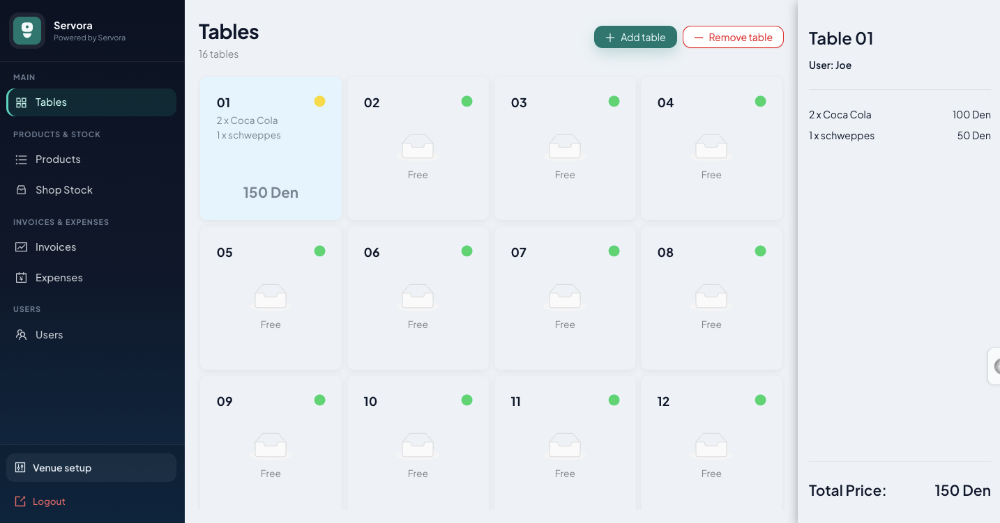
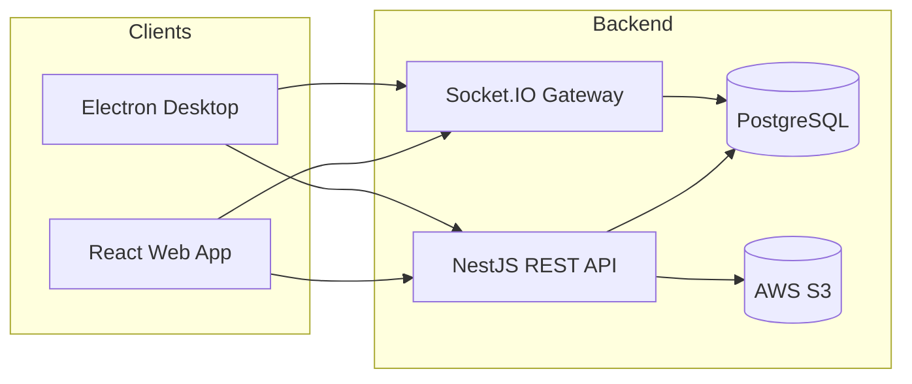
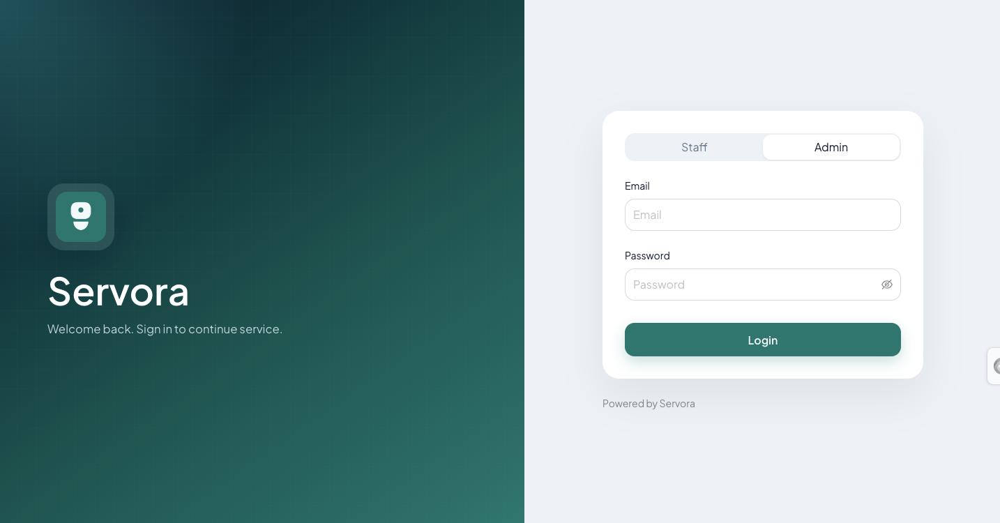
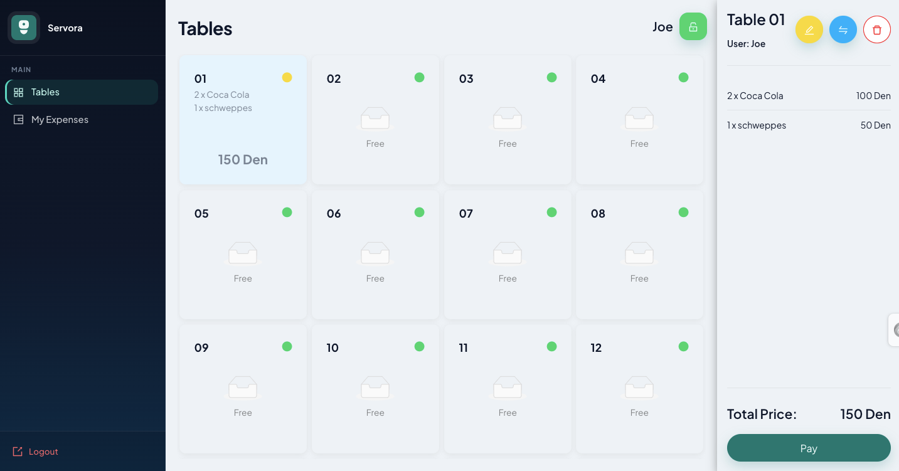
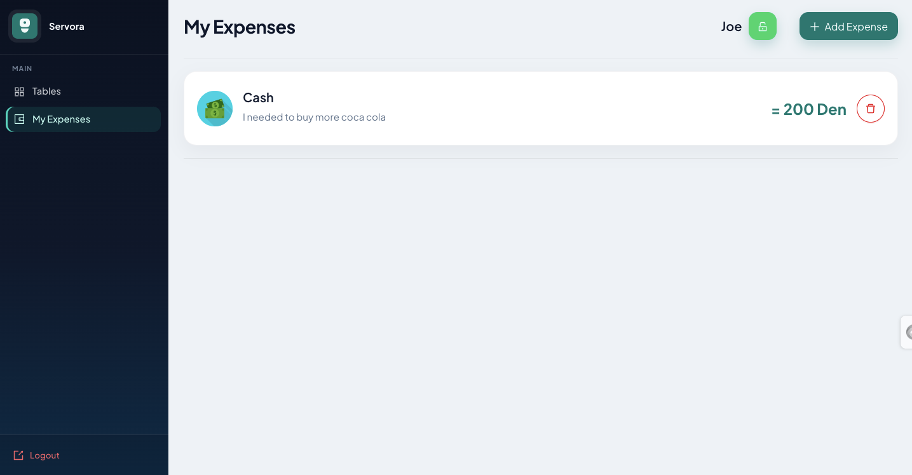

<p align="center">
  
</p>

<h1 align="center">Servora POS</h1>

<p align="center">
  A full-stack point-of-sale platform for cafés and restaurants — floor management, orders, inventory, reporting, and desktop deployment.
</p>

<p align="center">
  
  
  
  
  
</p>

<p align="center">
  
</p>

---

## Overview

**Servora** is a multi-tenant POS system built for venue operators and their staff. Admins manage the menu, inventory, team, and business settings. Workers sign in with a venue code and run day-to-day operations on a responsive floor plan — taking orders, processing payments, and printing receipts.

The project is a monorepo with three apps:

| App | Role |
|-----|------|
| `apps/frontend` | React SPA — POS UI, admin dashboards, real-time table sync |
| `apps/backend` | NestJS REST API + WebSockets, PostgreSQL, PDF reports, S3 uploads |
| `apps/electron` | Desktop wrapper bundling frontend + backend for on-premise installs |

---

## Features

### Floor & orders
- Interactive table floor plan with live order status
- Real-time table updates across devices via **WebSockets**
- Add products to tables, adjust quantities, move orders between tables
- Checkout flow with payment and receipt printing (web + Electron)
- Staff verification lock for sensitive actions

### Menu & inventory
- Product catalog with categories and images
- Stock tracking with add/remove quantity workflows
- Product availability tied to inventory levels

### Business operations
- **Shift registration** — open/close register sessions with cash reconciliation
- **Sales archive** — filter paid orders by date and staff member
- **Staff expenses** — track worker payouts and costs
- **PDF reports** — monthly summaries and stock-check exports

### Team & access
- **Admin login** — email/password for full venue management
- **Worker login** — 4-digit venue code for floor staff
- Role-based navigation (admin vs worker views)
- User management with staff accounts

### Venue setup
- Company profile — name, address, phone, logo upload
- Configurable table count
- Admin password management
- Multi-language UI: **English**, **Albanian**, **Macedonian**

### Desktop
- Electron app packages the full stack for local/offline-capable deployment
- Thermal receipt printing support through the desktop shell

---

## Tech stack

**Frontend**
- React 19, TypeScript, Vite
- Redux Toolkit, React Router
- Ant Design, Sass
- Socket.IO client, i18next
- React DnD (touch + mouse backends for tablet support)

**Backend**
- NestJS 11, TypeORM
- PostgreSQL
- JWT authentication (Passport)
- Socket.IO (NestJS WebSockets)
- PDF generation (pdfmake), AWS S3 for file storage

**Desktop**
- Electron 35, electron-builder

---

## Architecture



---

## Project structure

```
servora-pos/
├── apps/
│   ├── frontend/          # React POS & admin UI
│   ├── backend/           # NestJS API, WebSockets, reports
│   └── electron/          # Desktop packaging
├── scripts/               # Shared build utilities
├── package.json           # Workspace root & dev scripts
└── README.md
```

---

## Getting started

### Prerequisites

- **Node.js** 20+
- **PostgreSQL** 14+
- **npm** (workspaces enabled)

Optional for full functionality:
- AWS S3 bucket (product/venue image uploads)
- Electron build tools (for desktop packaging)

### 1. Clone & install

```bash
git clone https://github.com/RahimHoxha/servora-pos.git
cd servora-pos
npm install
```

### 2. Environment variables

```bash
cp apps/backend/.env.example apps/backend/.env
cp apps/frontend/.env.example apps/frontend/.env
```

Edit `apps/backend/.env` with your database credentials, JWT secret, and AWS settings.  
Edit `apps/frontend/.env` if your API runs on a different host/port (default: `http://127.0.0.1:3001`).

### 3. Database

Create a PostgreSQL database matching `POSTGRES_DB` in your `.env` file.  
The backend uses TypeORM `synchronize: true` in local mode, so tables are created automatically on first run.

### 4. Seed an admin account (optional)

```bash
cd apps/backend
npm run seed:admin
```

This creates a company and admin user. Override defaults with env vars:

```bash
SEED_ADMIN_EMAIL=admin@example.com
SEED_ADMIN_PASSWORD=your-password
SEED_COMPANY_NAME="My Café"
```

### 5. Run in development

From the repo root, in two terminals:

```bash
# Terminal 1 — API (port 3001)
npm run backend:dev

# Terminal 2 — frontend (port 5173)
npm run web:dev
```

Open `http://localhost:5173` and sign in with your admin email or venue code.

---

## Scripts

| Command | Description |
|---------|-------------|
| `npm run web:dev` | Start frontend dev server |
| `npm run backend:dev` | Start NestJS API in watch mode |
| `npm run build:frontend` | Production build of the React app |
| `npm run build:prod:backend` | Production build of the API |
| `npm run package` | Build and package the Electron desktop app |

---

## Screenshots

### Login — staff & admin access
Dual login modes: workers sign in with a 4-digit venue code, admins with email and password.



### Admin floor plan
Full venue view with table grid, live order summaries, and checkout sidebar.


### Staff floor plan
Role-scoped navigation — workers see only tables and their own expenses.



### Staff expenses
Workers can log cash expenses during their shift with notes and amounts.



---

## Author

**Rahim Hoxha**

- GitHub: [@RahimHoxha](https://github.com/RahimHoxha)
- Repository: [servora-pos](https://github.com/RahimHoxha/servora-pos)

Built as a portfolio project demonstrating full-stack TypeScript development — from real-time POS workflows to desktop packaging.
